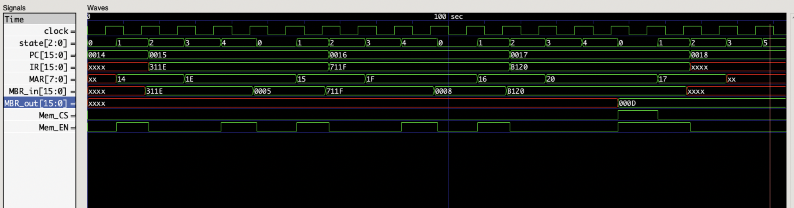

# Simple Computer In Verilog

project 1 in the computer organization course (ENCS2380) at Birzeit University

------------------------------

## [Project Paper](https://drive.google.com/file/d/1CynuBT3mAd_htxdpWnm3OeJVcPVh-bn9/view?usp=sharing)

------------------------------

## Modules

* [CPU.v](./modules/CPU.v)
CPU module that can execute the 3 instructions

* [MEM.v](./modules/MEM.v)
a 256 byte memory (128 cells each is 2 bytes)    

* [CLK_GEN.v](./modules/CLK_GEN.v)
a sample clock generator that inverts the clock signal each 5 ns (full cycle is 10 ns)    

* [Test_Bench.v](./modules/Test_Bench.v)
the test bench that connects the modules and is the top level file in the simulation        

------------------------------

## Running The Simulation

install [Icarus Verilog](https://github.com/steveicarus/iverilog) and add its binaries to your shell path then run the following

```
git clone https://github.com/ibraheemalayan/Simple_Computer_Verilog_Part_1.git
cd Simple_Computer_Verilog_Part_1/modules
iverilog -o compiled_testbench.vvp Test_Bench.v
vvp compiled_testbench.vvp
```

Then you can read the output of the display statments     
**OR**     
open the [waves.vcd](./modules/waves.vcd) using a wave viewer (eg: GTKwave)    


------------------------------

## Discussion

All the instructions were executed successfully.    


``` (instruction) Load R1, [30] ```
* the value `5` was loaded from memory address `30` to register `R1` in the CPU.     

``` (instruction) Add R1, [31] ```
* the value `8` was loaded from memory address `31` and added to the value of register `R1` which is `5`, then the result of the addition (`13`) was saved in the same register.     

``` (instruction) Store R1, [32] ```
* the value `13` of the register `R1` was stored on memory address `32`.    

* **The output `(200) > test > cell[70] > d` at time 190 ns proves that the simulation was successfull since the value of memory location 32 is the hexadecimal D, 13 in decimal which is the expected output (this output is generated at line 69 in [MEM.v](./modules/MEM.v))**


------------------------------


## Run Output (text)

> output of running the compiled Test_Bench

```
ibraheemalyan@Ibraheems-MacBook-Pro modules % vvp compiled_testbench.vvp

(0) > initializing clock generator ...
(0) > initializing memory ...
(0) > initializing CPU ...
(0) > running the test bench ...


 -------------------------- clock positive edge (t=5) --------------------------


 ~~~~~~~~~~~~~~ New Instruction Cycle ~~~~~~~~~~~~~~

(8) CPU > get_instruction_addr, PC=20


 -------------------------- clock positive edge (t=15) --------------------------


(16) Memory Read operation data_read=311e from address 20
(17) CPU > fetch_instruction
(17) CPU > MBR_in = 311e


 -------------------------- clock positive edge (t=25) --------------------------


(27) CPU > IR = 311e
(27) CPU > decode_instruction


 -------------------------- clock positive edge (t=35) --------------------------


(37) CPU > fetch_operand


 -------------------------- clock positive edge (t=45) --------------------------


(46) Memory Read operation data_read=5 from address 30
(47) CPU > execute


 -------------------------- clock positive edge (t=55) --------------------------


 ~~~~~~~~~~~~~~ New Instruction Cycle ~~~~~~~~~~~~~~

(58) CPU > get_instruction_addr, PC=21


 -------------------------- clock positive edge (t=65) --------------------------


(66) Memory Read operation data_read=711f from address 21
(67) CPU > fetch_instruction
(67) CPU > MBR_in = 711f


 -------------------------- clock positive edge (t=75) --------------------------


(77) CPU > IR = 711f
(77) CPU > decode_instruction


 -------------------------- clock positive edge (t=85) --------------------------


(87) CPU > fetch_operand


 -------------------------- clock positive edge (t=95) --------------------------


(96) Memory Read operation data_read=8 from address 31
(97) CPU > execute


 -------------------------- clock positive edge (t=105) --------------------------


 ~~~~~~~~~~~~~~ New Instruction Cycle ~~~~~~~~~~~~~~

(108) CPU > get_instruction_addr, PC=22


 -------------------------- clock positive edge (t=115) --------------------------


(116) Memory Read operation data_read=b120 from address 22
(117) CPU > fetch_instruction
(117) CPU > MBR_in = b120


 -------------------------- clock positive edge (t=125) --------------------------


(127) CPU > IR = b120
(127) CPU > decode_instruction


 -------------------------- clock positive edge (t=135) --------------------------


(137) CPU > fetch_operand


 -------------------------- clock positive edge (t=145) --------------------------


(147) CPU > execute


 -------------------------- clock positive edge (t=155) --------------------------


(156) Memory Write operation data_written=d at 32

 ~~~~~~~~~~~~~~ New Instruction Cycle ~~~~~~~~~~~~~~

(158) CPU > get_instruction_addr, PC=23


 -------------------------- clock positive edge (t=165) --------------------------


(166) Memory Read operation data_read=xxxx from address 23
(167) CPU > fetch_instruction
(167) CPU > MBR_in = xxxx


 -------------------------- clock positive edge (t=175) --------------------------


(177) CPU > IR = xxxx
(177) CPU > decode_instruction


 -------------------------- clock positive edge (t=185) --------------------------


(187) CPU > fetch_operand
(187) Unknown Opcode !


 -------------------------- clock positive edge (t=195) --------------------------


(200) > value of cell[32] (hexadecimal) is d


 -------------------------- clock positive edge (t=205) --------------------------


 -------------------------- clock positive edge (t=215) --------------------------


(220) > finishing simulation


ibraheemalyan@Ibraheems-MacBook-Pro modules % clear
ibraheemalyan@Ibraheems-MacBook-Pro modules % iverilog -o compiled_testbench.vvp Test_Bench.v
ibraheemalyan@Ibraheems-MacBook-Pro modules % vvp compiled_testbench.vvp
(0) > initializing clock generator ...
(0) > initializing memory ...
(0) > initializing CPU ...
(0) > running the test bench ...


 -------------------------- clock positive edge (t=5) --------------------------


 ~~~~~~~~~~~~~~ New Instruction Cycle ~~~~~~~~~~~~~~

(8) CPU > get_instruction_addr, PC=20


 -------------------------- clock positive edge (t=15) --------------------------


(16) Memory Read operation data_read=311e from address 20
(17) CPU > fetch_instruction
(17) CPU > MBR_in = 311e


 -------------------------- clock positive edge (t=25) --------------------------


(27) CPU > IR = 311e
(27) CPU > decode_instruction


 -------------------------- clock positive edge (t=35) --------------------------


(37) CPU > fetch_operand


 -------------------------- clock positive edge (t=45) --------------------------


(46) Memory Read operation data_read=5 from address 30
(47) CPU > execute


 -------------------------- clock positive edge (t=55) --------------------------


 ~~~~~~~~~~~~~~ New Instruction Cycle ~~~~~~~~~~~~~~

(58) CPU > get_instruction_addr, PC=21


 -------------------------- clock positive edge (t=65) --------------------------


(66) Memory Read operation data_read=711f from address 21
(67) CPU > fetch_instruction
(67) CPU > MBR_in = 711f


 -------------------------- clock positive edge (t=75) --------------------------


(77) CPU > IR = 711f
(77) CPU > decode_instruction


 -------------------------- clock positive edge (t=85) --------------------------


(87) CPU > fetch_operand


 -------------------------- clock positive edge (t=95) --------------------------


(96) Memory Read operation data_read=8 from address 31
(97) CPU > execute


 -------------------------- clock positive edge (t=105) --------------------------


 ~~~~~~~~~~~~~~ New Instruction Cycle ~~~~~~~~~~~~~~

(108) CPU > get_instruction_addr, PC=22


 -------------------------- clock positive edge (t=115) --------------------------


(116) Memory Read operation data_read=b120 from address 22
(117) CPU > fetch_instruction
(117) CPU > MBR_in = b120


 -------------------------- clock positive edge (t=125) --------------------------


(127) CPU > IR = b120
(127) CPU > decode_instruction


 -------------------------- clock positive edge (t=135) --------------------------


(137) CPU > fetch_operand


 -------------------------- clock positive edge (t=145) --------------------------


(147) CPU > execute


 -------------------------- clock positive edge (t=155) --------------------------


(156) Memory Write operation data_written=d at 32

 ~~~~~~~~~~~~~~ New Instruction Cycle ~~~~~~~~~~~~~~

(158) CPU > get_instruction_addr, PC=23


 -------------------------- clock positive edge (t=165) --------------------------


(166) Memory Read operation data_read=xxxx from address 23
(167) CPU > fetch_instruction
(167) CPU > MBR_in = xxxx


 -------------------------- clock positive edge (t=175) --------------------------


(177) CPU > IR = xxxx
(177) CPU > decode_instruction


 -------------------------- clock positive edge (t=185) --------------------------


(187) CPU > fetch_operand
(187) Unknown Opcode !


 -------------------------- clock positive edge (t=195) --------------------------


(200) > value of cell[32] (hexadecimal) is d


 -------------------------- clock positive edge (t=205) --------------------------


 -------------------------- clock positive edge (t=215) --------------------------


(220) > finishing simulation


```


## Simulation waveform on GTKwave

> Note: all the values below are in hexadecimal

